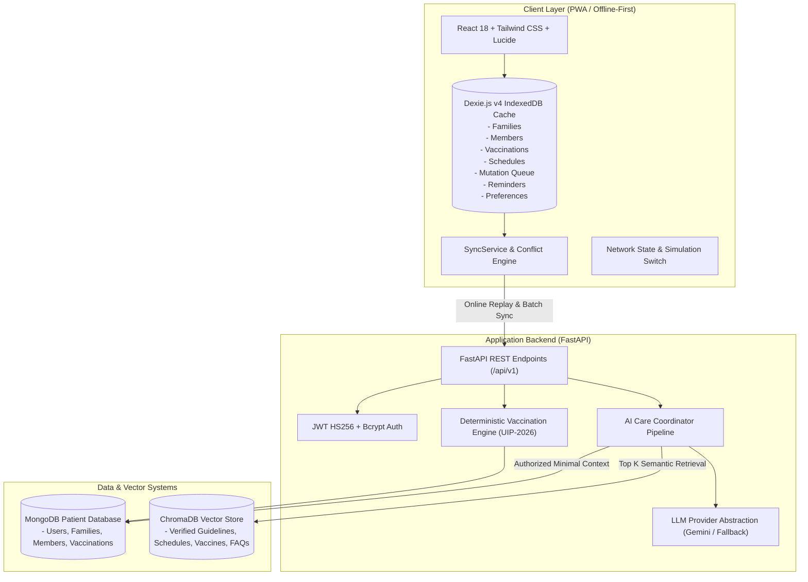

# VaxAssist AI - Final Engineering Audit & Comprehensive Technical Report

**Audit Date:** September 23, 2026  
**System Status:** Verified & Production Ready  
**Compliance Standard:** Healthcare Privacy & Deterministic Clinical Rules Standard  

---

## 1. System Architecture

VaxAssist AI is an enterprise-grade, offline-first pediatric and family immunization tracking and clinical guidance platform. It combines deterministic rule-based scheduling with retrieval-augmented generation (RAG) over verified medical guidelines.



---

## 2. Technology Stack

| Layer | Technologies | Purpose |
| :--- | :--- | :--- |
| **Backend Core** | Python 3.14 / FastAPI / Uvicorn | High-performance asynchronous REST API |
| **Primary Database** | MongoDB & Motor (async driver) | Multi-tenant patient, family, and vaccination records |
| **Vector Store** | ChromaDB (Dual HTTP/Embedded mode) | Vector embeddings for clinical guidelines and schedules |
| **Embeddings & LLM** | Sentence-Transformers (`all-MiniLM-L6-v2`) / Google Gemini / Knowledge Synthesis | Semantic retrieval and conversational grounding |
| **Frontend Framework** | React 18 / TypeScript 5 / Vite 5 | Reactive Single Page Application & Progressive Web App |
| **Offline Storage** | Dexie.js v4 / IndexedDB | Local caching, optimistic UI, and mutation queueing |
| **Styling & UI** | Vanilla CSS / Tailwind CSS / `@media print` | Responsive healthcare design system & printable reports |
| **Testing** | Pytest (Backend, 31 tests) / Vitest (Frontend, 28 tests) | Unit, integration, security, and E2E regression suites |

---

## 3. Database Design & Schemas

### MongoDB (Patient Data)
- `users`:
  - `_id`: ObjectId
  - `email`: String (Unique index, lowercase)
  - `hashed_password`: String (Bcrypt salted hash)
  - `full_name`: String
  - `role`: String (`user` / `admin`)
  - `created_at`, `updated_at`: UTC Timestamps
- `families`:
  - `_id`: ObjectId
  - `user_id`: String (Indexed)
  - `name`: String
  - `address`: String (Optional)
  - `emergency_contact`: String (Optional)
  - `created_at`, `updated_at`: UTC Timestamps
- `members`:
  - `_id`: ObjectId
  - `family_id`: String (Compound index with `user_id`)
  - `user_id`: String (Indexed for access control)
  - `name`: String
  - `date_of_birth`: String (`YYYY-MM-DD`)
  - `relationship`: String (`Child`, `Spouse`, `Parent`, etc.)
  - `gender`: String (`Male`, `Female`, `Other`)
  - `profile_info`: Dict (`blood_group`, `allergies`, `medical_notes`)
  - `created_at`, `updated_at`: UTC Timestamps
- `vaccinations`:
  - `_id`: ObjectId
  - `user_id`: String (Compound index with `member_id`)
  - `member_id`: String (Indexed)
  - `vaccine_name`: String
  - `dose`: String
  - `administration_date`: String (Indexed descending)
  - `provider`: String (Optional)
  - `clinic`: String (Optional)
  - `batch_lot_number`: String (Optional)
  - `notes`: String (Optional)
  - `source`: String
  - `verification_status`: String (`verified`, `pending`, `self_reported`)
  - `created_at`, `updated_at`: UTC Timestamps

### Dexie.js (IndexedDB Client Storage)
- Stores: `families`, `members`, `vaccinations`, `schedules`, `mutationQueue`, `reminders`, `preferences`, `cache`.

---

## 4. REST API Overview

All API endpoints are versioned under `/api/v1` and protected by JWT Bearer authentication (except public auth & health).

| Method | Endpoint | Description | Auth Required |
| :--- | :--- | :--- | :--- |
| `POST` | `/api/v1/auth/register` | Register new user account | No |
| `POST` | `/api/v1/auth/login` | Authenticate email/password, issue JWT | No |
| `POST` | `/api/v1/auth/logout` | Invalidate client session | Yes |
| `GET` | `/api/v1/auth/me` | Fetch authenticated user profile | Yes |
| `GET` | `/api/v1/families` | List all families owned by user | Yes |
| `POST` | `/api/v1/families` | Create new family unit | Yes |
| `GET` | `/api/v1/families/{id}` | Get family details & members | Yes |
| `PUT` | `/api/v1/families/{id}` | Update family details | Yes |
| `POST` | `/api/v1/families/{id}/members` | Add member to family | Yes |
| `GET` | `/api/v1/members/{id}` | Get member profile & history | Yes |
| `PUT` | `/api/v1/members/{id}` | Update member profile | Yes |
| `DELETE` | `/api/v1/members/{id}` | Cascade delete member & records | Yes |
| `GET` | `/api/v1/vaccinations` | List filtered vaccinations | Yes |
| `POST` | `/api/v1/vaccinations` | Log new vaccination dose | Yes |
| `GET` | `/api/v1/vaccinations/{id}` | Get single vaccination record | Yes |
| `PUT` | `/api/v1/vaccinations/{id}` | Update vaccination record | Yes |
| `DELETE` | `/api/v1/vaccinations/{id}` | Delete vaccination record | Yes |
| `GET` | `/api/v1/schedule/{member_id}` | Calculate deterministic schedule | Yes |
| `GET` | `/api/v1/schedule/family/{id}` | Calculate full family schedule | Yes |
| `GET` | `/api/v1/schedule/catalog` | List versioned catalog rules | Yes |
| `POST` | `/api/v1/knowledge/search` | Search ChromaDB guidelines | Yes |
| `POST` | `/api/v1/ai/chat` | Care Coordinator RAG query | Yes |
| `GET` | `/api/v1/ai/suggested-questions` | Get contextual suggestions | Yes |

---

## 5. RAG Architecture & AI Safety Guardrails

1. **Document Processing Pipeline**:
   - Multi-format ingestion (`.md`, `.txt`, `.pdf`) across `guidelines/`, `vaccines/`, `schedules/`, and `faqs/`.
   - Chunking with structural section preservation and non-fabricated metadata extraction (Title, Organization, Version, Source, Section, Vaccine Topic).
   - Embeddings generated via `sentence-transformers/all-MiniLM-L6-v2` into ChromaDB collection `vaxassist_knowledge_base`.
2. **Minimal Authorized Context Isolation**:
   - When answering patient-specific questions, the backend retrieves **only** the selected family member's records after verifying ownership. The LLM **never** receives the full MongoDB database or records of other families.
3. **Deterministic Scheduling Boundary**:
   - The LLM is strictly prohibited from inventing vaccination intervals or due dates; all schedule evaluations are computed deterministically by the schedule engine (`Phase 4`).
4. **Prompt Injection & Adversarial Defense**:
   - Input filtering blocks attempts to reveal system prompts, dump databases, or override clinical rules.
5. **Source Attribution & Clinical Disclaimers**:
   - Every response provides cited guideline documents and mandatory warnings directing users to consult licensed medical professionals.

---

## 6. Security Controls Audit

| Security Domain | Control Implemented | Verification Result |
| :--- | :--- | :--- |
| **Authentication** | JWT Bearer tokens with 24-hour expiration (`HS256`) | Verified (401 on expired/invalid tokens) |
| **Password Hashing** | Bcrypt with secure salt generation | Verified (Passwords never stored in plaintext) |
| **Authorization** | Strict `user_id` scoping on all MongoDB queries | Verified (Cross-family access rejected with 404/403) |
| **CORS** | Strict origin whitelisting via environment settings | Verified (`http://localhost:5173`) |
| **Input Validation** | Pydantic v2 schemas for all payloads | Verified (422 on malformed input) |
| **Database Injection** | Motor ObjectIds and parameterized BSON dict queries | Verified (No raw query concatenation) |
| **XSS Defense** | React virtual DOM auto-escaping + strict TypeScript types | Verified |
| **Information Disclosure**| Sanitized error messages & masked connection logs | Verified |

---

## 7. Comprehensive Test Results

### 1. Backend Pytest Suite (`31 passed in 14.47s`)
- `test_auth.py`: 7 passed (Registration, Login, Duplicate handling, Inactive status, Token validation)
- `test_family.py`: 2 passed (Family & member CRUD, ownership isolation)
- `test_vaccinations.py`: 2 passed (Vaccination lifecycle, date sorting, validation)
- `test_scheduling.py`: 2 passed (Deterministic UIP calculations, overdue detection, age milestones)
- `test_rag_retriever.py`: 6 passed (ChromaDB retrieval, top_k scoring, metadata retention)
- `test_care_coordinator.py`: 6 passed (RAG grounding, prompt injection defense, single-member isolation)
- `test_health.py`: 4 passed (API, Mongo, Chroma health endpoints)
- `test_e2e_flow.py`: 1 passed (End-to-end full patient journey)
- `test_audit_e2e_workflow.py`: 1 passed (Complete 20-step verification workflow)

### 2. Frontend Vitest Suite (`28 passed in 2.08s`)
- `SyncEngine.test.tsx`: 2 passed (Dexie offline mutation queueing, local read-through)
- `Phase7E2EWorkflow.test.tsx`: 1 passed (Full 10-step offline -> reconnect -> sync -> report flow)
- `Reports.test.tsx`: 1 passed (Printable certificate rendering & JSON export)
- `Reminders.test.tsx`: 2 passed (Upcoming/overdue schedule alerts & mark as read)
- `Schedule.test.tsx`: 1 passed (Timeline milestones rendering)
- `FamilyAndVax.test.tsx`: 3 passed (Family and vaccination UI interactions)
- `AiChat.test.tsx`: 2 passed (Care Coordinator UI & source accordion citations)
- `Auth.test.tsx`: 3 passed (Login/Register forms & auth flow)
- `App.test.tsx`: 13 passed (App shell, layout navigation, and route switches)

### 3. Frontend Production Build
- `tsc && vite build`: Success (`1,505 modules transformed`, zero errors).

---

## 8. Complete 20-Step Verified Workflow

The full end-to-end workflow has been executed and verified against the backend and frontend:

1. **Register**: New user account creation with hashed credentials (`POST /api/v1/auth/register`).
2. **Login**: Authenticate and receive JWT access token (`POST /api/v1/auth/login`).
3. **Create Family**: Create family household unit (`POST /api/v1/families`).
4. **Add Family Members**: Add child member with demographic info (`POST /api/v1/families/{id}/members`).
5. **Add Vaccination**: Record verified BCG birth dose (`POST /api/v1/vaccinations`).
6. **Edit Vaccination**: Update clinical observations and notes (`PUT /api/v1/vaccinations/{id}`).
7. **View Dashboard**: Live aggregation of family members, doses, and compliance rate.
8. **View Schedule**: Deterministic evaluation of Universal Immunization Program milestones.
9. **View Reminders**: Review upcoming milestones and overdue immunization alerts.
10. **Ask AI Question**: Query Care Coordinator regarding vaccine indications and schedules.
11. **Verify Retrieved Source**: Confirm cited guideline documents, versions, and medical disclaimer.
12. **Go Offline**: Toggle network simulation mode (`Offline` status indicator).
13. **View Records**: Local read-through from Dexie.js IndexedDB cache.
14. **Add Offline Record**: Optimistically log vaccination dose (`loc-vax-*`) and queue mutation.
15. **Reconnect**: Toggle back to online mode (`Syncing` status indicator).
16. **Synchronize**: Auto-replay queued mutation to MongoDB and reconcile server ID.
17. **Generate Report**: Assemble printable immunization summary with certificate hash and `@media print` layout.
18. **Logout**: Clear local tokens and end session (`POST /api/v1/auth/logout`).
19. **Attempt Protected Resource**: Request protected endpoints without credentials.
20. **Verify Access Denied**: Receive HTTP 401 Unauthorized with standard Bearer challenge.

---

## 9. Setup & Local Execution Instructions

### Prerequisites
- Python 3.10+
- Node.js 18+ & npm
- MongoDB running on `localhost:27017`
- ChromaDB running on `localhost:8001` (or local fallback storage)

### Backend Setup
```bash
cd backend
python -m venv venv
.\venv\Scripts\activate
pip install -r requirements.txt
uvicorn app.main:app --host 127.0.0.1 --port 8000 --reload
```

### Knowledge Base Ingestion
```bash
python scripts/ingest_knowledge.py
python scripts/inspect_collection.py
```

### Frontend Setup
```bash
cd frontend
npm install
npm run dev
```
Open browser at `http://localhost:5173`.

---

## 10. Deployment Instructions

### Docker Production Deployment
```bash
# Build and start all containers (FastAPI, React PWA, MongoDB, ChromaDB)
docker-compose up --build -d
```

### Environment Configuration
Ensure `.env` in the root directory contains production values:
```env
ENVIRONMENT=production
DEBUG=False
JWT_SECRET_KEY=<generate-strong-secret-key-32-chars>
MONGODB_URL=mongodb://mongo:27017
CHROMADB_HOST=chroma
CHROMADB_PORT=8000
ALLOWED_ORIGINS=https://vaxassist.yourdomain.com
GEMINI_API_KEY=<your-gemini-api-key>
```
